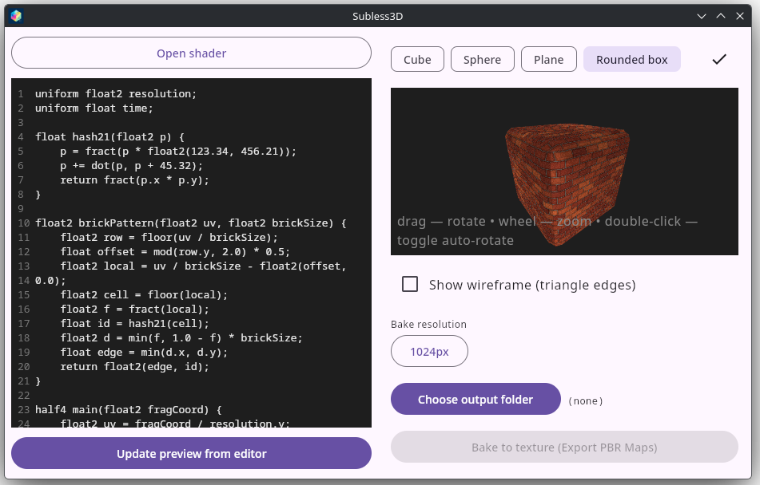

# Subless3D — Shader Baker

A desktop application for previewing, debugging, and baking fragment shaders into
PBR texture maps. Built with Kotlin, Compose Multiplatform, and Skia (SkSL).
Runs on Linux with a single command.

---

## Table of Contents

- [Overview](#overview)
- [Features](#features)
- [Quick Start](#quick-start)
- [Application Icon](#application-icon)
- [Shader Format Compatibility](#shader-format-compatibility)
- [Supported Shader Dialects](#supported-shader-dialects)
- [What Is Not Supported](#what-is-not-supported)
- [Automatic Preprocessing](#automatic-preprocessing)
- [Manual Fixes for Common Issues](#manual-fixes-for-common-issues)
- [Working Examples](#working-examples)
- [Using the Application](#using-the-application)
- [Output Files](#output-files)
- [Project Structure](#project-structure)
- [Known Limitations](#known-limitations)
- [Performance Notes](#performance-notes)
- [Roadmap](#roadmap)
- [Dependencies](#dependencies)
- [License](#license)

---

## Overview

Subless3D is a tool for shader artists and technical artists who want to:

1. **Write or paste** a fragment shader in a text editor with line numbers.
2. **Load shaders from disk** in any supported dialect.
3. **See the result** rendered on a 3D primitive (cube, sphere, plane, or
   rounded box) in real time.
4. **Bake the shader** into standard PBR texture maps at a chosen resolution
   and save them as PNG files.

The whole pipeline is powered by Skia's `RuntimeEffect` — the same engine used
by Chrome and Android to render SkSL shaders. No OpenGL context, no GPU driver
setup, no native compilation. Just Kotlin, Compose, and Skia.

---

## Features

### Editor
- Monospaced text field with **line numbers**
- Adjustable font size and line height
- Works with three shader dialects: SkSL, ShaderToy GLSL, classic GLSL
- Automatic preprocessing converts non-SkSL dialects on the fly
- **Open shader** button loads `.glsl`, `.frag`, `.vert`, `.sksl`, `.txt` files
- Errors from Skia are displayed inline, positioned over the preview

### 3D Preview
- Four primitives:
    - **Cube** — box-projected UV per face
    - **Sphere** — equirectangular spherical UV
    - **Plane** — flat 0..1 UV
    - **Rounded Box** — box-projected UV on the rounded geometry
- Automatic rotation on startup
- Interactive camera controls:
    - **Drag (LMB)** — rotate
    - **Scroll wheel** — zoom
    - **Double-click** — toggle auto-rotation
- Textured mesh rendering with perspective-correct UV interpolation
- Back-face culling
- Optional wireframe overlay

### Baking
- Resolution dropdown: **256**, **512**, **1024**, **2048**, **4096**, **8192**
- Choose any output directory via native file chooser
- Generates two files per bake:
    - `subless_albedo_<res>.png` — the shader output
    - `subless_normal_<res>.png` — tangent-space normal map derived from albedo luminance
- Bake status text below the button (baking / done / error)

### Preprocessing
- `#define`, `#ifdef`, `#ifndef`, `#endif` expansion
- Token replacement (`vecN` → `floatN`, `matN` → `floatNxN`)
- ShaderToy built-in uniform substitution (`iTime`, `iResolution`, `iMouse`, `iFrame`)
- Signature transformation (`void mainImage(...)` → `half4 main(float2)`)
- Return statement generation from `fragColor` / `gl_FragColor` assignments
- Explicit error messages for unsupported constructs

---

## Quick Start

### Requirements

- **JDK 17** or newer
- **Linux** with X11 or Wayland
- **Gradle** (wrapper included in the repository)

### Build and run

```bash
./gradlew run
```

The application window opens with a default shader already loaded.
Press **Update preview from editor** to re-render after editing.

### Build a standalone distribution

```bash
./gradlew packageDistributionForCurrentOS
```

The resulting `.deb` / `.rpm` / `.tar.gz` is placed in `build/compose/binaries/`.

---

## Application Icon

The window icon and the distribution icon are configured separately.

### Window icon (code)

Place a square PNG (recommended 256×256 or 512×512) at
`src/main/resources/app_icon.png`. Load it in `Main.kt`:

```kotlin
import androidx.compose.ui.res.loadImageBitmap
import androidx.compose.ui.graphics.painter.BitmapPainter
import java.io.File

val icon = BitmapPainter(
    File("src/main/resources/app_icon.png").inputStream().buffered().use {
        loadImageBitmap(it)
    }
)

Window(
    onCloseRequest = ::exitApplication,
    title = "Subless3D",
    icon = icon,
    state = rememberWindowState(width = 1400.dp, height = 900.dp)
) {
    MaterialTheme {
        Surface(modifier = Modifier.fillMaxSize()) {
            AppScreen(remember { AppState() })
        }
    }
}
```

The `loadImageBitmap` API works on all Compose Multiplatform versions. The
newer `decodeToImageBitmap` from `org.jetbrains.compose.resources` is only
available in Compose 1.8.0+; on 1.7.0 you must use `loadImageBitmap`.

### Distribution icon (Gradle)

In `build.gradle.kts`, add the import at the top of the file:

```kotlin
import org.jetbrains.compose.desktop.application.dsl.TargetFormat
```

Then inside `compose.desktop { application { nativeDistributions { ... } } }`:

```kotlin
nativeDistributions {
    targetFormats(TargetFormat.Deb, TargetFormat.Rpm)
    packageName = "Subless3D"
    packageVersion = "1.0.0"

    linux {
        iconFile.set(project.file("src/main/resources/app_icon.png"))
    }
}
```

Without the `import` line, Gradle will fail with
`Unresolved reference 'TargetFormat'`.

---

## Shader Format Compatibility

The most important section of this document. Read carefully before pasting a
shader from the internet.

| Format | Status | What you need in the shader | What happens automatically |
|--------|:------:|-----------------------------|----------------------------|
| **SkSL (native)** | ✅ Full | `half4 main(float2 fragCoord)` | Nothing — compiled as-is |
| **ShaderToy** | ✅ Full | `void mainImage(out vec4 fragColor, in vec2 fragCoord)` | Rename `mainImage` → `main`, `fragColor = …` → `return`, substitute `iTime`/`iResolution`/`iMouse`, expand `#define`/`#ifdef` |
| **Classic GLSL** | ✅ Full | `void main()` + `gl_FragColor = …` | Signature rewrite, `gl_FragColor`/`gl_FragCoord` substitution, `vecN` → `floatN`, `matN` → `floatNxN`, strip `precision`/`attribute`/`varying` |
| **Babylon.js / Three.js / Unity / Godot** | ❌ Not supported | — | — |
| **ShaderToy with `iChannel0..3`** | ❌ Not supported | — | Explicit error is raised |
| **Any shader using `texture()` or `texture2D()`** | ❌ Not supported | — | Explicit error is raised |
| **Any shader with `varying` or `attribute`** | ❌ Not supported | — | — |
| **Any shader with `gl_Position`, `worldViewProjection`, `vNormalW`, `vPositionW`** | ❌ Not supported | — | — |
| **Multi-pass shaders (feedback buffers)** | ❌ Not supported | — | — |

---

## Supported Shader Dialects

### 1. SkSL (native)

The native Skia shading language. Passed straight to `RuntimeEffect.makeForShader()`
without any preprocessing. Preprocessing is skipped if the shader already contains
`half4 main(float2 …)`.

**Required:**
- Entry point: `half4 main(float2 fragCoord)`
- Return value: `half4` (RGB + A)
- Inputs: `fragCoord`, and any `uniform` you declare

**Available uniforms** (declared by you, set by the runtime):
- `float2 resolution` — canvas size in pixels
- `float time` — time in seconds (currently always `0` in preview and bake)

**Advantages over GLSL:**
- No version pragmas
- No `precision` qualifiers
- `half` and `float` are first-class types

### 2. ShaderToy GLSL

The dialect used on [shadertoy.com](https://www.shadertoy.com/). Uses a special
entry point and a set of built-in uniforms.

**Required:**
- Entry point: `void mainImage(out vec4 fragColor, in vec2 fragCoord)`
- Assign the final color to `fragColor`

**Built-in uniforms that get substituted:**

| ShaderToy | Becomes |
|-----------|---------|
| `iTime` | `time` |
| `iResolution` | `float3(resolution, 1.0)` |
| `iMouse` | `float4(0.0)` (unused, always zero) |
| `iFrame` | `0` |
| `iChannel0..3` | ❌ Not supported — explicit error |
| `iDate` | ❌ Not supported |

### 3. Classic GLSL (fragment shader)

Traditional fragment shader format used by most OpenGL tutorials, books, and
older engines.

**Required:**
- Entry point: `void main()`
- Assign the final color to `gl_FragColor`

**What gets stripped:**
- `precision highp float;` and variants
- `attribute …` declarations
- `varying …` declarations

**What gets substituted:**

| Classic GLSL | Becomes |
|--------------|---------|
| `gl_FragCoord` | `fragCoord` |
| `gl_FragColor` | `return half4(…)` |
| `vec2` / `vec3` / `vec4` | `float2` / `float3` / `float4` |
| `mat2` / `mat3` / `mat4` | `float2x2` / `float3x3` / `float4x4` |

---

## What Is Not Supported

### `iChannel0`, `iChannel1`, `iChannel2`, `iChannel3`

These are ShaderToy's external texture inputs. They can carry:
- Procedural noise textures
- Previous frame buffers (for feedback effects)
- Cubemaps for reflections
- Keyboard, audio, or video data

**Why not supported:** the SkSL fragment shader has no external texture inputs in
our pipeline. It receives only `fragCoord`, `resolution`, and `time`. Every value
must be computed procedurally.

**Workaround:** rewrite the shader to generate its input procedurally. A common
substitution is to replace `texture(iChannel0, uv).rgb` with a procedural noise
function (e.g., value noise, FBM, Worley).

### `texture()` and `texture2D()`

Any texture lookup in the shader body. Same reason as above — no texture input.

**Workaround:** replace with procedural noise. For example:

```glsl
// Was: vec3 n = texture(iChannel0, uv).rgb;
float n = fbm(uv * 8.0); // Procedural FBM
```

### `varying` / `attribute`

These keywords declare interpolated data passed from a vertex shader to a
fragment shader. In SkSL, there is no vertex shader — the fragment shader runs
on a flat 2D rectangle. There is no interpolated `vUV`, `vNormal`, or
`vPosition`.

**Workaround:** use `fragCoord / resolution` as `vUV`. Replace normal or
position data with fixed or procedurally-computed values.

### `gl_Position`, `gl_VertexID`, `gl_InstanceID`

Vertex shader built-ins. Not available in a fragment-only pipeline.

### Engine-specific uniforms

`worldViewProjection`, `world`, `vEyePosition`, `u_CameraPosition`, `_Time`,
`unity_ObjectToWorld`, and similar — all engine-specific. They have no meaning
in a 2D fragment shader. Remove them, or replace with hard-coded values.

### Multi-pass / feedback shaders

Shaders that require reading their own previous output (`iChannel0` pointing to
the same buffer, ping-pong buffers, temporal accumulation) cannot be ported to
our single-pass pipeline. Examples: bloom pipelines, motion-blur trails,
progressive path tracers.

### Other GLSL features not in SkSL

- `round(float)` — SkSL's `round` takes only `half`. Use `floor(x + 0.5)`.
- Bitwise `&`, `|`, `<<`, `>>` over `int` — sometimes rejected by the compiler
  in certain contexts. Prefer arithmetic (`x / pow2`) or `floor`/`mod` chains.
- `%` (modulo) — works for `int` in most builds, but not guaranteed. Use
  `x - floor(x / y) * y` for floats, and `x - (x / y) * y` for ints.
- Dynamic array indexing with non-constant indices.
- `while` loops with non-constant bounds (prefer `for` with a fixed iteration count).
- Global non-const variables with initializers — move them inside `main`.
- Function overloads — SkSL does not disambiguate by parameter type. Rename
  (`mod289v3`, `mod289v4`) instead.
- `out` / `inout` parameters in user functions — return a struct or a packed
  vector instead.

---

## Automatic Preprocessing

The preprocessor in `ShaderPreview.kt` (`glslToSksl`) performs the following
transformations in order.

### Step 1 — Detect native SkSL

If the shader already contains `half4 main(float2 …)`, it is returned unchanged.
This means an SkSL shader that happens to contain `vec2` in a comment or string
will not be mangled.

### Step 2 — Collect `#define` directives

Every `#define NAME value` is stored in a map. Value-less defines (`#define FLAG`)
are stored with the value `1.0`.

### Step 3 — Expand conditional compilation

- `#ifdef NAME … #endif` — kept if `NAME` is defined, removed otherwise.
- `#ifndef NAME … #endif` — inverted logic.
- Nested conditionals are handled one level at a time; deep nesting may not
  expand correctly.
- `#else` is not currently supported.

### Step 4 — Remove `#define` lines

After collecting the values and expanding conditionals, the original `#define`
lines are removed from the source.

### Step 5 — Expand macros

Every occurrence of a defined macro name is replaced with its value. Names are
sorted by length (longest first) so that `NUM_LIGHTS` is substituted before
`NUM`.

### Step 6 — Detect unsupported constructs

If the shader contains `iChannel0..3` or `texture(`, preprocessing raises an
explicit error. This prevents a cryptic SkSL error later.

### Step 7 — ShaderToy uniform substitution

| Before | After |
|--------|-------|
| `iResolution` | `float3(resolution, 1.0)` |
| `iTime` | `time` |
| `iMouse` | `float4(0.0)` |
| `iFrame` | `0` |

### Step 8 — Token replacement

| Before | After |
|--------|-------|
| `vec2` / `vec3` / `vec4` | `float2` / `float3` / `float4` |
| `mat2` / `mat3` / `mat4` | `float2x2` / `float3x3` / `float4x4` |
| `gl_FragCoord` | `fragCoord` |
| `fract` | `fract` (unchanged — same in both languages) |

### Step 9 — Strip GLSL-only keywords

Lines starting with `precision`, `attribute`, or `varying` are removed.

### Step 10 — Rewrite entry point

For ShaderToy style:
- Find `void mainImage(out float4 NAME, in float2 ARG)`
- Replace with `half4 main(float2 ARG)`
- Find the last `NAME = expr;` and replace with `return half4(…)`
- If `expr` is already `float4(...)`, wrap as `half4(expr)`, otherwise
  `half4(half3(expr), 1.0)`

For classic style:
- Find `void main()` or `void main(void)`
- Replace with `half4 main(float2 fragCoord)`
- Find the last `gl_FragColor = expr;` and replace with `return half4(…)`
- Same wrapping logic as above

---

## Manual Fixes for Common Issues

Some issues cannot be fixed automatically. Here is a checklist of things to do
when a shader fails to compile.

### `error: no match for round(float)`

SkSL's `round` accepts only `half`, not `float`.

**Fix:** replace `round(x)` with `floor(x + 0.5)`.

### `error: unknown identifier 'xyz'`

A variable was declared inside a conditional block that got removed by the
preprocessor, or a global variable with a non-constant initializer was moved
out of scope.

**Fix:** declare variables inside `main`, or ensure the block containing the
declaration is not stripped.

### `error: type mismatch`

A `floatN` where a `halfN` was expected, or vice versa. Usually occurs at the
return statement.

**Fix:** ensure the final return is `half4(half3(color), half(1.0))` — every
component wrapped in `half`.

### `error: cannot find function 'texture'` or similar

The shader uses an external texture. See [What Is Not Supported](#what-is-not-supported).

**Fix:** rewrite the shader to use procedural noise.

### `error: swizzle assignment not supported`

SkSL supports swizzle assignment (`p.xz = …`), but some versions of Skia
disallow it in certain contexts.

**Fix:** use a temporary variable:

```glsl
// Before
p.xz = mat2(cos(a), -sin(a), sin(a), cos(a)) * p.xz;

// After
float2 tmp = p.xz;
tmp = float2x2(cos(a), -sin(a), sin(a), cos(a)) * tmp;
p = float3(tmp.x, p.y, tmp.y);
```

### `error: cannot index array with variable index`

SkSL arrays can only be indexed with compile-time constants.

**Fix:** unroll the array into individual named variables (`p0`, `p1`, …), or
replace array access with an `if / else if` chain that maps index to value.

```glsl
// Before
float2 p[9];
for (int i = 0; i < 9; i++) p[i] = getPos(id, float2(i, 0));

// After
float2 p0 = getPos(id, float2(0.0, 0.0));
float2 p1 = getPos(id, float2(1.0, 0.0));
// … 7 more …
```

### `error: expected ',' or ')' — bitwise operator`

`&`, `|`, `<<`, `>>` are rejected in some SkSL builds.

**Fix:** use arithmetic. To test bit `k` of an integer:

```glsl
// Slow but portable:
int div = 1;
for (int i = 0; i < k; i++) div = div * 2;
bool bit = ((segments / div) - (segments / div / 2) * 2) == 1;
```

Or better — avoid `int` entirely. Use independent `float` flags:

```glsl
float b0 = step(0.5, hash11(seed + 0.0));
float b1 = step(0.5, hash11(seed + 1.0));
// … etc
```

### `Shader error: Uniform 'time' not found`

The shader does not declare or use a `time` uniform. Skia strips unused
uniforms, and the runtime fails when trying to set them.

**Fix:** this is handled automatically — the uniform binding is wrapped in
`try/catch`. If you still see this error, check that `renderShaderToImage`
uses the version with `try/catch`.

### Performance: preview appears to hang

The shader is heavy. See [Performance Notes](#performance-notes).

---

## Working Examples

### Minimal SkSL — horizontal gradient

```glsl
uniform float2 resolution;
uniform float time;

half4 main(float2 fragCoord) {
    float2 uv = fragCoord / resolution;
    return half4(half3(uv.x, uv.y, 0.5), 1.0);
}
```

### ShaderToy — pulsing rings

```glsl
uniform vec2 resolution;
uniform float time;

void mainImage(out vec4 fragColor, in vec2 fragCoord) {
    vec2 uv = fragCoord / resolution;
    vec2 p = uv - 0.5;
    float d = length(p);
    float rings = sin(d * 30.0 - time * 2.0) * 0.5 + 0.5;
    fragColor = vec4(rings, d * 1.5, 1.0 - d, 1.0);
}
```

### Classic GLSL — screen-space UV gradient

```glsl
precision highp float;
uniform vec2 resolution;
uniform float time;

void main() {
    vec2 uv = gl_FragCoord.xy / resolution;
    gl_FragColor = vec4(uv.x, uv.y, 0.5 + 0.5 * sin(time), 1.0);
}
```

### ShaderToy with `#define` — concentric rings

```glsl
#define PI 3.14159265
#define RINGS 12.0
#define BG vec3(0.05, 0.05, 0.1)

uniform vec2 resolution;
uniform float time;

void mainImage(out vec4 fragColor, in vec2 fragCoord) {
    vec2 uv = fragCoord / resolution - 0.5;
    float d = length(uv);
    float ang = atan(uv.y, uv.x);
    float rings = sin(d * RINGS * PI - time * 2.0) * 0.5 + 0.5;
    vec3 col = BG + vec3(rings, rings * 0.5, 1.0 - rings);
    fragColor = vec4(col, 1.0);
}
```

### Tileable caustic water

```glsl
uniform float2 resolution;
uniform float time;

float2 hash22(float2 p) {
    float3 p3 = fract(float3(p.xyx) * float3(443.897, 441.423, 437.195));
    p3 += dot(p3, p3.yzx + 19.19);
    return fract((p3.xx + p3.yz) * p3.zy);
}

float causticTile(float2 p, float period) {
    float2 n = floor(p);
    float2 f = fract(p);
    float md1 = 1.0;
    float md2 = 1.0;
    for (int j = -1; j <= 1; j++) {
        for (int i = -1; i <= 1; i++) {
            float2 g = float2(float(i), float(j));
            float2 cell = mod(n + g, float2(period));
            float2 o = hash22(cell);
            o = 0.5 + 0.5 * sin(time * 0.9 + o * 6.2831);
            float2 r = g + o - f;
            float d = dot(r, r);
            if (d < md1) { md2 = md1; md1 = d; }
            else if (d < md2) { md2 = d; }
        }
    }
    float edge = sqrt(md2) - sqrt(md1);
    return exp(-14.0 * edge * edge);
}

half4 main(float2 fragCoord) {
    float2 uv = fragCoord / resolution;

    float c1 = causticTile(uv * 5.0, 5.0);
    float c2 = causticTile(uv * 9.0 + 7.3, 9.0);
    float c3 = causticTile(uv * 14.0 + 11.7, 14.0);
    float caustic = max(max(c1, c2 * 0.75), c3 * 0.5);

    float3 col = float3(0.02, 0.18, 0.52);
    col = mix(col, float3(0.06, 0.42, 0.82), smoothstep(0.02, 0.50, caustic) * 0.85);
    col = mix(col, float3(0.22, 0.78, 0.98), smoothstep(0.15, 0.65, caustic) * 0.6);
    col = mix(col, float3(0.90, 0.98, 1.00), smoothstep(0.50, 0.90, caustic));

    return half4(half3(col), 1.0);
}
```

### 2D brick pattern (lightweight, always compiles)

```glsl
uniform float2 resolution;
uniform float time;

float hash21(float2 p) {
    p = fract(p * float2(123.34, 456.21));
    p += dot(p, p + 45.32);
    return fract(p.x * p.y);
}

float2 brickPattern(float2 uv, float2 brickSize) {
    float2 row = floor(uv / brickSize);
    float offset = mod(row.y, 2.0) * 0.5;
    float2 local = uv / brickSize - float2(offset, 0.0);
    float2 cell = floor(local);
    float2 f = fract(local);
    float id = hash21(cell);
    float2 d = min(f, 1.0 - f) * brickSize;
    return float2(min(d.x, d.y), id);
}

half4 main(float2 fragCoord) {
    float2 uv = fragCoord / resolution.y * 4.0;
    uv.x += time * 0.05;

    float2 brick = brickPattern(uv, float2(0.5, 0.22));
    float edge = brick.x;
    float id = brick.y;

    float3 brickA = float3(0.55, 0.18, 0.10);
    float3 brickB = float3(0.72, 0.30, 0.14);
    float3 brickC = float3(0.40, 0.12, 0.08);
    float3 brickColor = mix(mix(brickA, brickB, id), brickC, fract(id * 7.3));

    float3 mortarColor = float3(0.55, 0.52, 0.48);
    float mortar = 1.0 - smoothstep(0.0, 0.012, edge);
    float3 col = mix(brickColor, mortarColor, mortar);

    float ao = smoothstep(0.0, 0.05, edge);
    col *= mix(0.6, 1.0, ao);

    col = pow(max(col, float3(0.0)), float3(0.85));
    return half4(half3(col), 1.0);
}
```

### Low-poly stylized ground

```glsl
uniform float2 resolution;
uniform float time;

float hash21(float2 p) {
    return fract(sin(dot(p, float2(12.9898, 78.233))) * 43758.5453);
}

float2 hash22(float2 p) {
    float3 p3 = fract(float3(p.xyx) * float3(0.1031, 0.1030, 0.0973));
    p3 += dot(p3, p3.yzx + 33.33);
    return fract((p3.xx + p3.yz) * p3.zy);
}

half4 main(float2 fragCoord) {
    float2 uv = (fragCoord - 0.5 * resolution) / resolution.y;
    uv *= 8.0;
    uv.y += time * 0.1;

    float2 p = floor(uv);
    float2 f = fract(uv);

    float minDist = 9.0;
    float secondDist = 9.0;
    float2 centerPoint = float2(0.0);
    float2 cellId = float2(0.0);

    for (int j = -2; j <= 2; j++) {
        for (int i = -2; i <= 2; i++) {
            float2 neighbor = float2(float(i), float(j));
            float2 point = hash22(p + neighbor);
            point = 0.5 + 0.4 * sin(time * 0.2 + point * 6.2831);

            float2 diff = neighbor + point - f;
            float d = dot(diff, diff);

            if (d < minDist) {
                secondDist = minDist;
                minDist = d;
                centerPoint = diff;
                cellId = p + neighbor;
            } else if (d < secondDist) {
                secondDist = d;
            }
        }
    }

    float edgeDist = sqrt(secondDist) - sqrt(minDist);
    float cellDist = sqrt(minDist);

    float colorNoise = hash21(cellId);
    float colorNoise2 = hash21(cellId + 13.7);

    float3 groundColor = float3(0.38, 0.24, 0.15);
    if (colorNoise > 0.75) {
        groundColor = float3(0.48, 0.32, 0.20);
    } else if (colorNoise < 0.25) {
        groundColor = float3(0.28, 0.18, 0.12);
    } else if (colorNoise > 0.5 && colorNoise < 0.6) {
        groundColor = float3(0.40, 0.38, 0.35);
    }

    float height = sin(cellId.x * 0.5) * cos(cellId.y * 0.5) * 0.4 + colorNoise * 0.2;

    float hXp = sin((cellId.x + 1.0) * 0.5) * cos(cellId.y * 0.5) * 0.4
              + hash21(cellId + float2(1.0, 0.0)) * 0.2;
    float hYp = sin(cellId.x * 0.5) * cos((cellId.y + 1.0) * 0.5) * 0.4
              + hash21(cellId + float2(0.0, 1.0)) * 0.2;

    float3 faceNormal = normalize(float3(centerPoint.x, centerPoint.y, 0.5));
    float3 heightNormal = normalize(float3(
        (height - hXp) * 3.0,
        (height - hYp) * 3.0,
        1.0
    ));

    float3 normal = normalize(faceNormal * 0.7 + heightNormal * 0.6);
    float3 randomNormalMod = float3(hash22(cellId) - 0.5, 0.0) * 0.6;
    normal = normalize(normal + randomNormalMod);

    float3 lightDir = normalize(float3(0.5, 0.7, 1.0));
    float diffuse = max(dot(normal, lightDir), 0.0);

    float rim = 1.0 - max(dot(normal, float3(0.0, 0.0, 1.0)), 0.0);
    rim = smoothstep(0.4, 0.7, rim) * 0.15;

    float ao = clamp(cellDist * 1.4, 0.4, 1.0);
    float crack = smoothstep(0.02, 0.10, edgeDist);
    float crackShadow = mix(0.45, 1.0, crack);

    float3 finalColor = groundColor * (diffuse * 1.1 + 0.3);
    finalColor *= ao * crackShadow;
    finalColor += float3(0.5, 0.45, 0.35) * rim;

    float crevice = smoothstep(0.06, 0.0, edgeDist);
    finalColor = mix(finalColor, finalColor * 0.55, crevice * 0.7);

    float mossMask = smoothstep(0.70, 0.85, colorNoise2);
    finalColor = mix(finalColor, finalColor * float3(0.75, 1.05, 0.70), mossMask * 0.3);

    float2 target_uv = fragCoord / resolution;
    float vignette = target_uv.x * target_uv.y * (1.0 - target_uv.x) * (1.0 - target_uv.y);
    vignette = clamp(pow(16.0 * vignette, 0.25), 0.0, 1.0);
    finalColor *= mix(0.6, 1.0, vignette);

    return half4(half3(clamp(finalColor, 0.0, 1.0)), 1.0);
}
```

---

## Using the Application

### Layout

The window is split into two halves:

- **Left half** — **Open shader** button, code editor with line numbers, and
  the **Update preview from editor** button.
- **Right half** — shape selector chips, help button, preview viewport,
  wireframe toggle, resolution dropdown, output folder picker, and the
  **Bake to texture** button with a status line below.

### Workflow

1. Type a shader in the left editor, or press **Open shader** to load one
   from disk (`.glsl`, `.frag`, `.vert`, `.sksl`, `.txt`).
2. Press **Update preview from editor** to compile and render.
3. If compilation fails, an error appears in the top-left corner of the preview.
4. Rotate / zoom the preview to inspect the shader from different angles.
5. Choose the shape: **Cube**, **Sphere**, **Plane**, or **Rounded Box**.
6. Toggle **Show wireframe** to overlay triangle edges.
7. Choose the bake resolution from the dropdown.
8. Choose the output folder.
9. Press **Bake to texture (Export PBR Maps)** to write the PNG files.

### Preview controls

| Action | Control |
|--------|---------|
| Rotate the object | Click and drag with LMB |
| Zoom in / out | Scroll wheel |
| Toggle auto-rotation | Double-click |

### Draft vs applied shader

The editor holds a **draft**. The preview and bake use the **applied** shader,
which is updated only when you press **Update preview from editor**. This lets
you type freely without breaking the preview mid-edit.

If the button is not pressed, editing the text has no effect on the preview.

Opening a file via **Open shader** sets both the draft and the applied shader at
once, so the preview updates immediately.

---

## Output Files

### `subless_albedo_<res>.png`

The shader output rendered into an off-screen Skia surface at `<res> × <res>`
pixels, encoded as PNG. This is the "base color" of the material.

- Color space: sRGB (linear values written directly, no gamma conversion)
- Alpha: always 1.0 (fully opaque)
- Format: 8-bit RGBA PNG

### `subless_normal_<res>.png`

A tangent-space normal map derived from the albedo luminance via a central
difference (Sobel-like) filter.

- Normal components are encoded as `RGB = (n * 0.5 + 0.5) * 255`
- Tangent-space convention: +X right, +Y up, +Z out of the surface
- Strength: 2.0 (adjustable in `Bake.kt`)
- Sobel uses pixel neighbours with a wrap-around at the borders (tileable)

Both files share the same `<res>` in their name, so bakes at different
resolutions do not overwrite each other.

`bakeShader` returns `Result<Unit>`. On success the status line shows
`Done. Files written to <folder>`. On failure it shows `Error: <message>`.

---

## Project Structure

```
src/main/kotlin/com/example/subless3d/
├── Main.kt             Entry point — creates the Compose window, loads icon
├── AppState.kt         Observable state: draft shader, applied shader,
│                       resolution, selected shape, output folder,
│                       bake status, wireframe toggle
├── AppScreen.kt        Root composable — layout, editor with line numbers,
│                       open-file button, chips, bake controls
├── ShaderPreview.kt    Preview canvas, mesh builders (cube / sphere /
│                       plane / rounded box), mesh rasterization
│                       (drawTexturedMesh, computeProjectiveMatrix),
│                       offscreen rendering (renderShaderToImage),
│                       GLSL → SkSL preprocessor (glslToSksl)
├── Bake.kt             bakeShader — writes albedo + normal PNGs,
│                       returns Result<Unit>
├── ShapeType.kt        enum { CUBE, SPHERE, PLANE, ROUNDED_BOX }
└── HelpDialog.kt       Help dialog with format compatibility notes
```

### Key data flow

1. **User types** → `AppState.shaderCode` (draft)
2. **Presses "Update"** → `AppState.appliedShader = shaderCode`
3. **`ShaderPreview` reacts** → calls `renderShaderToImage(appliedShader, 1024)`
   via `LaunchedEffect`
4. **`renderShaderToImage`** → `glslToSksl()` → `RuntimeEffect.makeForShader()`
   → `RuntimeShaderBuilder` → `Surface.makeRasterN32Premul()` → `Image`
5. **`Image` is stored** in preview state and used as a texture in
   `drawTexturedMesh`
6. **Bake button** → `bakeShader(state)` → calls `renderShaderToImage()` at
   the chosen resolution → writes PNGs → updates `state.bakeStatus`

### UV projections per shape

| Shape | Projection |
|-------|-----------|
| **Cube** | Box projection per face (each face gets full 0..1 UV) |
| **Sphere** | Equirectangular (u = φ / 2π, v = θ / π) |
| **Plane** | Flat 0..1 across the quad |
| **Rounded Box** | Box projection per source face, wraps smoothly across fillets |

---

## Known Limitations

### Preview is static

`renderShaderToImage` is called once per `appliedShader` change, always with
`time = 0f`. Shaders that depend on `time` will appear frozen in the preview.
For baking this is fine (each bake is a single frame). Live animation in the
preview is on the roadmap.

### No z-buffer in mesh rendering

`drawTexturedMesh` uses painter's algorithm: triangles are sorted by centroid
depth and drawn back-to-front. For convex primitives (cube, sphere, rounded
box) this is exact. For non-convex or self-intersecting meshes you will see
artifacts.

### Affine UV interpolation for small triangles

The projective matrix is computed per triangle. For large, highly oblique
triangles the interpolation is exact (projective-correct), but for very small
triangles the floating-point error can produce a visible seam. Subdividing
large faces (the rounded box already does this with 12×12 quads per face) helps.

### Sphere seam

Equirectangular UV projection has a seam at the +X axis of the sphere. This is
unavoidable for this projection. If your shader tiles in the U direction (like
the caustic water), the seam is invisible. If it does not, use a different
projection or accept the seam.

### File picker on Linux

The **Open shader** and **Choose output folder** buttons use
`javax.swing.JFileChooser`. This works out of the box on Linux with X11 or
Wayland, but requires a JVM with Swing support (any standard JDK 17+ does).
If you later port to macOS or Windows, the same code works — but for a native
look, consider `java.awt.FileDialog` or a platform wrapper library.

### No texture inputs

See [What Is Not Supported](#what-is-not-supported). SkSL fragment shaders in
our pipeline have no sampler inputs. All inputs must be procedural.

### No `#else` in the preprocessor

`#ifdef` / `#ifndef` are supported, but `#else` inside them is not. If your
shader uses it, remove the alternative branch manually or restructure so all
branches that matter compile together.

### No function-like macros

`#define FOO(x) ...` is not expanded. Only object-like macros (`#define NAME value`)
work.

### No syntax highlighting yet

The editor shows line numbers and supports scroll, but does not highlight
keywords, comments, or numbers. This is on the roadmap.

---

## Performance Notes

### Preview size

The offscreen render is always at **1024 × 1024** in the preview, regardless of
window size. This is a compromise between sharpness and speed. If you want a
faster preview for heavy shaders, lower this in `renderShaderToImage`.

### Heavy shaders

Shaders with raymarching, path tracing, or many iterations of noise can take
**5 to 60 seconds** to render at 1024×1024. This is CPU rendering via Skia's
raster backend — no GPU acceleration.

Common hotspots:

| Construct | Typical cost |
|-----------|--------------|
| `for (int i = 0; i < 256; i++)` raymarch | Dominant — 256 map evaluations per pixel |
| `for (int i = 0; i < 128; i++)` soft shadow | Second — 128 evaluations per pixel |
| `for (int i = 0; i < 6; i++)` FBM | 6× noise = 48 hash evaluations per pixel |
| `for (int j = -1; j <= 1; j++) for (int i = -1; i <= 1; i++)` Worley | 9-cell search per pixel per octave |
| Nested 5×5 Voronoi with FBM inside | Very heavy — 25 cells × multiple noise calls |

**Recommended reductions for preview:**

- Raymarching: 256 → 64 iterations
- Soft shadow: 128 → 32 iterations
- FBM: 6 → 4 octaves
- Voronoi: 5×5 → 3×3 (loses precision on cell borders)
- Sample count in chromatic aberration / bloom loops: 18 → 6

### Bake speed

Bake at 2048×2048 is roughly 4× slower than 1024×1024 and 16× slower than
512×512. For heavy shaders, bake at 512 to test, then at 2048 for the final
asset. The bake runs on the IO dispatcher, so the UI stays responsive, but
you will wait for the result.

### `time` in the preview

`time` is always `0f` in preview and bake. Shaders that rely on animated
parameters will show a static frame — usually the "first" frame. If your
shader looks broken at `time = 0`, try shifting the phase:

```glsl
float t = time + 3.0;  // skip the very start of the animation
```

---

## Roadmap

### Short term

- [ ] Animated preview (re-render offscreen image every frame with updated `time`)
- [ ] Syntax highlighting in the editor (GLSL / SkSL keywords, comments, numbers)
- [ ] `#else` support in the preprocessor
- [ ] Function-like macro expansion
- [ ] `Save shader as...` button

### Medium term

- [ ] Roughness map baking
- [ ] Metallic map baking
- [ ] Ambient occlusion map baking (from albedo or height)
- [ ] Height map baking
- [ ] MRT-style single-pass baking of multiple maps
- [ ] Preset shader library with a dropdown

### Long term

- [ ] Optional OpenGL backend via LWJGL + ComposeGL for full GLSL support
  (raymarching, texture inputs, `varying`/`attribute`, multi-pass feedback)
- [ ] Export to standard PBR workflows (Blender, Substance, Unreal)
- [ ] Custom mesh import (OBJ)
- [ ] Compute-shader based baking for GPU acceleration

---

## Dependencies

| Library | Version | Purpose | License |
|---------|---------|---------|---------|
| Kotlin | 2.0.20 | Language | Apache 2.0 |
| Compose Multiplatform | 1.7.0 | UI framework | Apache 2.0 |
| Skiko | 0.8.18 | Kotlin bindings to Skia | Apache 2.0 |
| Skia (bundled) | — | 2D rendering, SkSL runtime | BSD-3-Clause |
| kotlinx-coroutines | (bundled) | Async / suspend | Apache 2.0 |
| Java Swing (`JFileChooser`) | JDK 17 | File and folder dialogs | GPL v2 with Classpath Exception |

---

## License

The Subless3D application code is provided as-is for educational and personal
use. See the `LICENSE` file in the repository root for the full text.

Shaders shared in the `examples/` directory may be subject to their authors'
licenses. In particular:

- Shaders from ShaderToy are typically shared under **CC BY-NC-SA 3.0** unless
  stated otherwise. Check the original source before redistributing.
- Some shaders are explicitly released under **CC0 1.0** (public domain). Those
  can be used freely, including commercially.

The Skia engine and Skiko bindings are governed by their own licenses (see
`NOTICE` in the Skiko repository).

 
